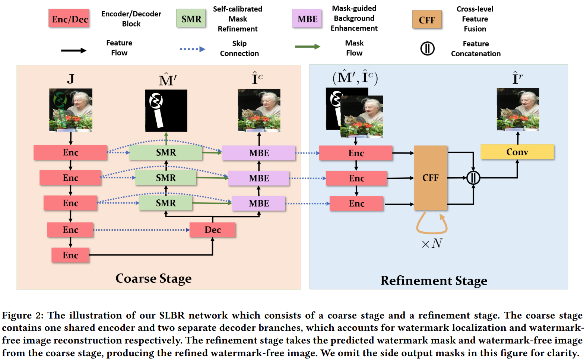
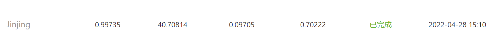
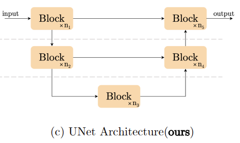
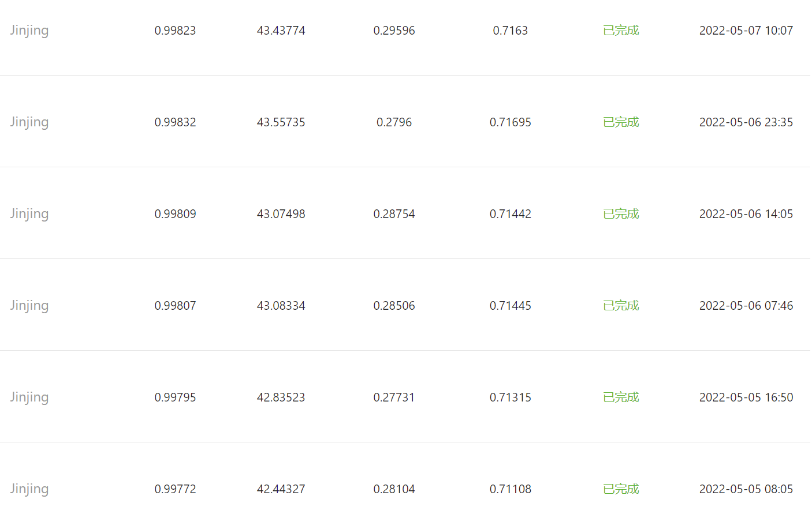
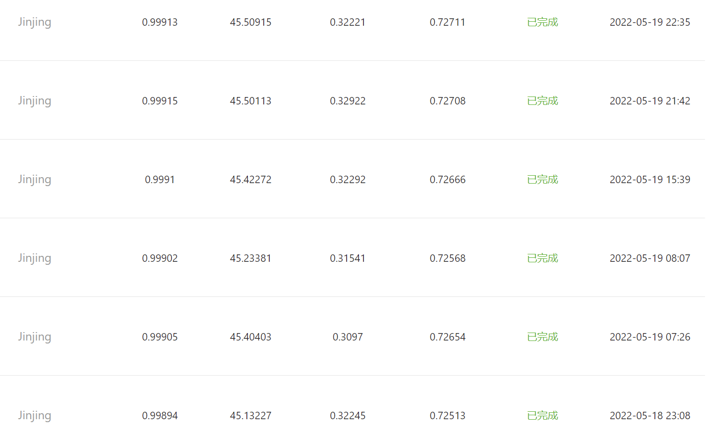
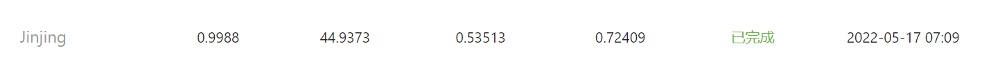

# 百度网盘AI大赛-水印智能消除赛第3名方案

- 简介  
  这是我们参加[百度水印智能消除赛](https://aistudio.baidu.com/aistudio/competition/detail/209/0/introduction)的代码与模型，代码实现主要参考了[SLBR](https://github.com/bcmi/SLBR-Visible-Watermark-Removal)和[百度摩尔纹消除赛baseline](https://aistudio.baidu.com/aistudio/projectdetail/3220041).


- 准备

  安装运行环境：  
  ```python
  pip install -r requirements.txt
  ```

- 模型选择

  在模型调优之前，需要选择一个合适的模型作为baseline，官方提供的[baseline](https://aistudio.baidu.com/aistudio/projectdetail/3859316)太过简单，所以我们考虑还是拜托对官方基线的依赖。官方给了三个水印消除的工作，我们考虑使用发表时间较近的[SLBR](https://github.com/bcmi/SLBR-Visible-Watermark-Removal)作为我们的主要学习资料. SLBR的主要结构如下图所示：

  <div align="center">
    
  </div>  

- 参数设置以及参数遍历

  ```python
    parser.add_argument('--batch_size',dest='batch_size',help='batch_size',type=int,default=4)
    parser.add_argument('--max_epochs',dest='max_epochs',help='max_epochs',type=int,default=10)
    parser.add_argument('--log_iters',dest='log_iters',help='log_iters',type=int,default=100)
    parser.add_argument('--save_interval',dest='save_interval',help='save_interval',type=int,default=1)
    parser.add_argument('--sample_interval',dest='sample_interval',help='sample_interval',type=int,default=100)
    parser.add_argument('--seed',dest='seed',help='random seed',type=int,default=24)

    optimizer = paddle.optimizer.Adam(parameters=generator.parameters(), learning_rate=1e-4,
                                      beta1=0.5, beta2=0.999)
  ```

  batch_size: 在模型较小的时候，我们设置了batch_size=8，但是随着模型加深，参数量不断增加，由于设备限制，我们将batch_size设置为4.
  学习率：比赛中期，我们尝试将学习率上升调整为2e-4，但是训练的效果并不理想，所以设置为了1e-4；从经验上讲，收敛后继续讲学习率调整小，分数还是有所提升，但是这样的技巧不足以甩开对手，所以我们保持了学习率不变。

- 模型改进
  我们参考的SLBR主要由两个部分组成：Coarse Stage 和 Refinement Stage。Coarse Stage是我们的baseline，A榜上用baseline第一次提交的分数结果如下：
  <div align="center">
    
  </div>  
  可以看到这个分数是很理想的，所以我们在此基础继续尝试进行改进。可以看到，提高分数的关键是在refinement stage的模型设计，这部分的任务主要是继续进行图像恢复任务，同时需要考虑到计算时间的限制，官方要求每一张图像的计算时间不可以超过1.2s，所以我们考虑了一种轻量化的图像恢复模型[NAFNET](https://github.com/megvii-research/NAFNet),该模型在图像去噪和去模糊上都有很好的效果，结构如下：
  <div align="center">
    
  </div>
  我们尝试用该结构作为了我们refinement stage的backbone。 分数较baseline虽然有了不错的提升，该模型的提交结果如下： 
  <div align="center">
    
  </div>
  虽然有了不错的提升，但是相比较于其他的竞争对手，这个分数还是不够的，所以后来我们考虑放弃了这个结构，重新考虑refinement. 经过思考，SLBR在refinement中合理考虑了mask feature的融合，这是我们没有做到的，所以我们重新用paddle改写了SLBR的refinement的部分，并且只用了里面的dec_conv2，太多的通道数反而会导致模型难以收敛，这部分细节如下：

  ```python
  # slbr_naf.py line:206
  self.dec_conv2 = nn.Sequential(nn.Conv2D(ngf*1,ngf*1,1,1,0))
  self.dec_conv3 = nn.Sequential(nn.Conv2D(ngf*2,ngf*1,1,1,0), nn.LeakyReLU(0.2), nn.Conv2D(ngf, ngf, 3,1,1), nn.LeakyReLU(0.2))
  self.dec_conv4 = nn.Sequential(nn.Conv2D(ngf*4,ngf*2,1,1,0), nn.LeakyReLU(0.2), nn.Conv2D(ngf*2, ngf*2, 3,1,1), nn.LeakyReLU(0.2))
  ```

  经过这样的改进后，我们提交的验证分数有了进一步的提高：
  <div align="center">
    
  </div>

- 待改进的点

  水印消除的任务中，我们了解到mask feature对实验结果的影响是非常高的，如何生成准确稳定的mask是任务的关键，我们也尝试过对训练数据中的数据对直接进行相减取绝对值来生成mask，在用这样的mask引导模型生成对应的mask，但是这样做的效果也并不理想，所以我们暂时放弃考虑了这个点，如果这个问题处理得比较好，那么分数一定会得到更明显的提升。我们也尝试直接用vgg loss来改进生成的mask图，但是验证的分数也不理想，提交结果如下：
  <div align="center">
    
  </div>

- 其他

  该仓库中包含了我们训练的log文件：nohup.out。前面的log因为我们的失误，输出了太多的空白，在log最后是我们最近提交验证的训练log。

- 训练

  在训练之前请修改main.py里面的相关配置，如：dataset_root
  ``` python
  python main.py
  ```

- 推理预测

  测试之前请修改好里面的数据路径。
  ```python
  python predict.py   # inference testA or testB
  ```